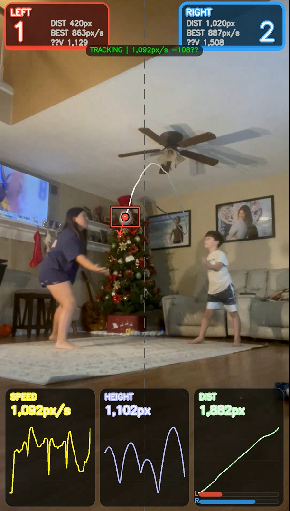

# bounceNtrace

Video analytics for ball tracking and scoreboard overlays using OpenCV.



## Setup

```bash
pip install -r requirements.txt
```

## Tools

### ball_track.py

Tracks object position/velocity. Exports CSV and annotated video.

```bash
python ball_track.py --video input.mov --show
```

**Outputs:**
- `ball_track.csv`: Frame-by-frame position (x, y), velocity (vx, vy), speed, angle.
- `ball_track_annot.mp4`: Video with bounding box and trail.
- `ball_track_plots.png`: Time-series plots (x, y, speed).

### ball_scoreboard.py

Tracks ball, detects hits (vertical velocity flip), and renders 2-player scoreboard (L/R) with stats.

```bash
python ball_scoreboard.py --video input.mov --mid-x 0.5
```

**Outputs:**
- `ball_scoreboard_annot.mp4`: Video with stats overlay.
- `ball_scoreboard_frames.csv`: Frame analytics.
- `ball_scoreboard_hits.csv`: Detected hit events.
- `ball_scoreboard_arcs.csv`: Arc trajectory data between hits.

### ball_scoreboard_broadcast.py

Alternate renderer for scoreboard with broadcast-style graphics (scorebug, sparklines, progress bars).

```bash
python ball_scoreboard_broadcast.py --video input.mov
```

**Outputs:**
- Same CSV structure as `ball_scoreboard.py`.
- `ball_broadcast_annot.mp4`.

### make_speed_versions.py

Generates retimed versions of input video by modifying output FPS.

```bash
python make_speed_versions.py --video ball_broadcast_annot.mp4 90 75 50
```

**Outputs:**
- `*_90pct.mp4` (0.9x speed)
- `*_75pct.mp4` (0.75x speed)
- `*_50pct.mp4` (0.5x speed)

## Configuration

Common flags for tracking scripts:

| Flag | Description | Default |
|------|-------------|---------|
| `--video` | Input video path | Required |
| `--tracker` | OpenCV tracker (`csrt`, `kcf`) | `csrt` |
| `--downscale` | Processing scale (0.0-1.0) | `1.0` |
| `--start-frame` | Start index | `0` |
| `--init-bbox` | Initial ROI `x,y,w,h` | Interactive |

**Hit Detection Logic**

Hits trigger when vertical velocity (`vy`) flips from positive (down) to negative (up) exceeding thresholds.

- `--hit-vy-down`: Min downward velocity before hit (px/s).
- `--hit-vy-up`: Min upward velocity after hit (px/s).
- `--hit-speed-min`: Min absolute speed.
- `--hit-cooldown-frames`: Min frames between hits.

**Coordinates**

- Origin: Top-left.
- Y-axis: Down.
- Units: Pixels.

## License

MIT
